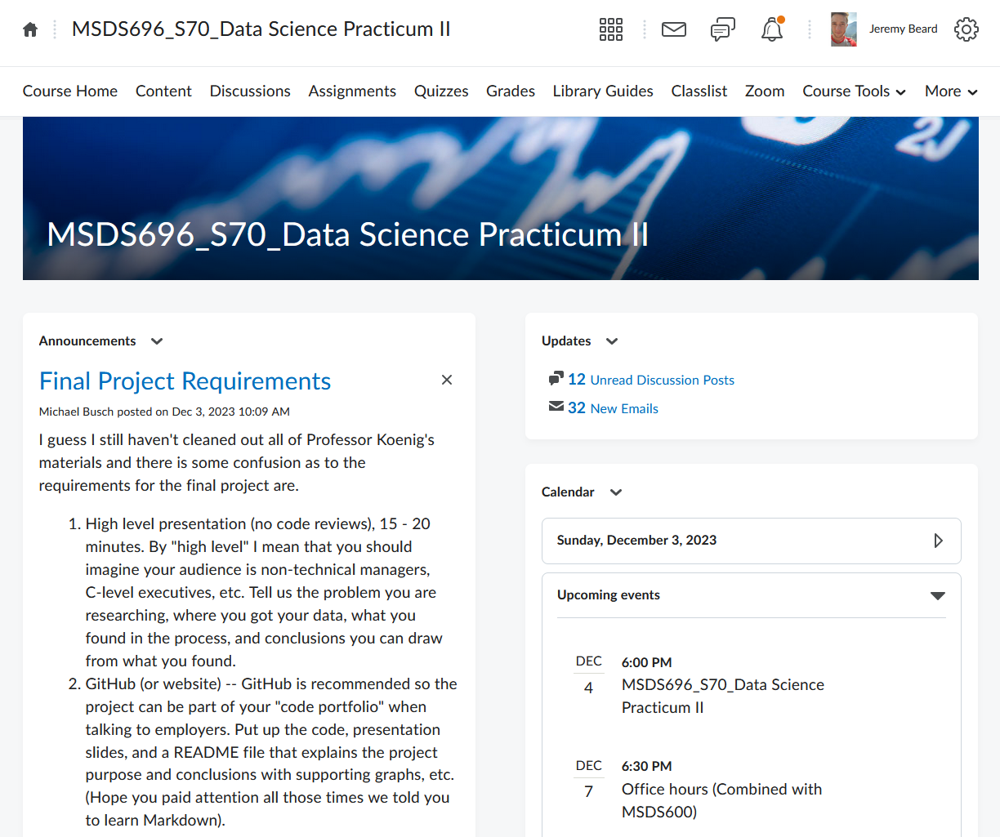

# MSDS696

(don't worry, this is my only wordcloud!)

# MSDS692

**Presidential Sentiment Analysis**

by

Jeremy Beard

# Table of Contents

[Main Ideas](#mainideas)

[Problem Statement](#problemstatement)

[Methods](#methods)

[Results](#results)

[Conclusions](#conclusions)

[Future Work](#future)

[References](#references)

<a name="mainideas"/>

# Main Ideas
This project is centered around  

The project will utilize a variety 

<a name="problemstatement"/>

# Problem Statement

<a name="methods"/>

# Methods

This project will seek to explore esults!

<a name="results"/>

# Results

For my results, I created a LOT of charts

## Measuring Word Count 

Sample Section

## Measuring Speech Substance

Sample Section

## Measuring Vocabulary / Amount of Unique Words per Speech

Sample Section

## Sentiment / Polarity / Subjectivity Measures

Sample Section

## 1-gram / 2-gram / 3-gram Charts of Interest

I found that the 2-gram charts were really the "sweet spot" in terms of useful information. 1-gram charts (or, the common word charts) didn't really give much information, and 3-gram charts were more general and less specific than the 2-gram charts. I included a few of the 2-gram and 3-gram charts below. For a complete list of all the 1-gram/2-gram/3-gram charts, please see the 'output' folder of my project. 

<a name="conclusions"/>

# Conclusions

In conclusion, 

<a name="future"/>

# Future Work

This project was a huge learning experience 

Thank you!

Jeremy Beard 

<a name="references"/>

# References

Please see my PowerPoint Presentation for proper APA citations of all my resources.

The dataset I used was located at: 

I also utilized all of my old text-based homework assignments for references.

Aside from that, I utilized www.phind.com for unimportant technical questions where I couldn't remember specific syntax of certain operations. I also heavily referenced the matplotlib documentation for assistance with visualization items. 

