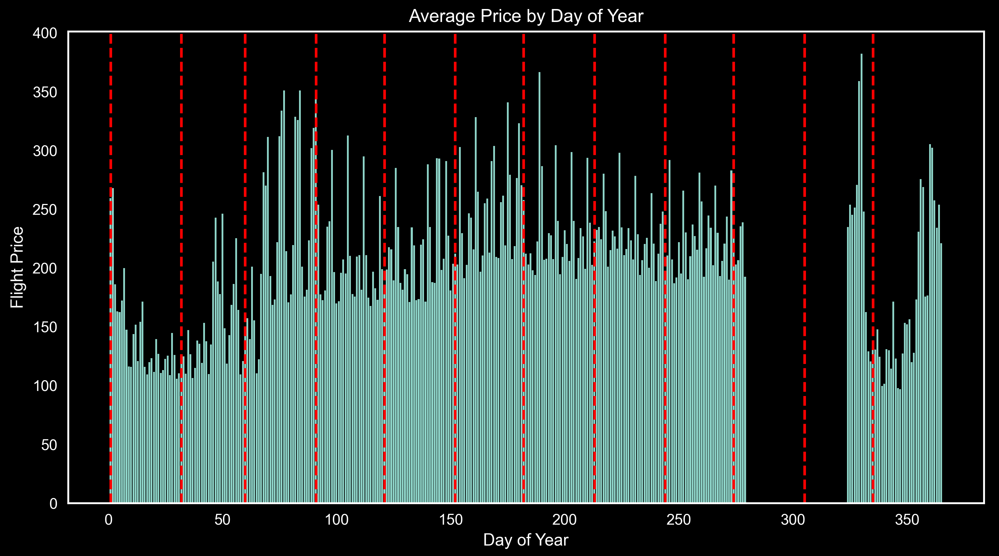

# MSDS696

# MSDS696: Final Capstone

**Machine Learning in the Clouds**

by

Jeremy Beard

# Table of Contents

[Youtube Presentation](#youtube)

[Main Ideas](#mainideas)

[Problem Statement](#problemstatement)

[Introduction](#intro)

[Methods](#methods)

[EDA](#eda)

[Results](#results)

[Conclusions](#conclusions)

[Future Work](#future)

[References](#references)

<a name="youtube"/>

# Youtube Presentation 

https://youtu.be/sUgiseRjJC0

<a name="mainideas"/>

# Main Ideas

This project is centered around an effort to scrape real-time flights and utilize it for a price prediction model. An Application Programming Interface (API) was utilized (see references below) in order to obtain ~45,000 real flights, primarily from United, American, and Frontier Airlines. 

Following the web-scraping of this project, I created a wide array of Machine Learning (ML) models to compare and be able to reliably predict (within $22) what price a flight will be. 

Many more details will be shared, so let's continue    :) 

<a name="problemstatement"/>

# Problem Statement

The main problem we were seeking to solve is:

"How can we reliably predict trends with flight prices in order to leverage the best days, times, and airlines on which to travel?" 

Another angle of my problem statement is:

"How can we reliably predict trends and prices for air travel based on common real-life
inputs to leverage the same ML tactics corporations are utilizing, but on consumer-side?"

<a name="intro"/>

# Introduction

Obviously there are websites which exist today that serve to find consumers the cheapest flights for a specific time period and destination, but these websites are often slow and filled with advertisements and depend on an internet connection. I had a need for creating Denver-based flight prediction models for myself and others that could go beyond what is already offered. The model shown in this repository, while being built upon a dataset which relies on an internet connection, can act independently of an internet connection and is without advertisements.  

The tool built seeks to serve as an initial check into which days and which airlines should be noted as typically the cheaper options for a specific route and specific day. Using this tool, the user can view trends in flight prices and can input a specific route to view what the predicted price will be on that day. 

The challenge is to implement a web-scraping solution that extracts relevant data, including departure details, flight duration, layovers, class types, and current/historical pricing information, from a relevant online source (or sources). Following that, the goal is to create an ACCURATE machine learning model. 

The solution I created will empower stakeholders with valuable insights for informed decision-making in the airline industry!

<a name="methods"/>

# Methods

This project involves five (5) main efforts for predicting these flight prices. The overall process though is pretty simple and is as follows:

* Figure out a way to scrape real flights from the internet to create a large database with which to create a model.

* Perform exploratory data analytics on the flight database, ensuring data is clean prepared for model analytics.

* Create Tableau dashboards to see at-a-glance which days, weeks, months, and airlines are cheapest for flying.

* Take data from the flight database and do comparative analysis on different ML models in order to create the most accurate model for predicting flight prices.

* Choose the most accurate model and validate the accuracy!

Within the machine learning aspect of the project, there were really two (2) main focuses: comparative analytics among ML models, as well as time-based analysis and determining the best way to handle time-series data. 

I was new to handling time-series data and didn't know which method would be the best and most accurate in handling this data within a machine learning context. I chose 3-5 formats for the datetimes in the dataset, including ordinal datetimes as well as utilizing the time.mktime() package to create floating-point datetime fields. 

Once we scrape all the flights we need and perform the comparative analysis, we will have a machine learning model that is Denver-focused and can help to quickly assist the user in selecting a flight which is satisfactory to them! 

### Which Models?

To be able to compare a large amount of machine learning models across numerous variations of datetime formats, I utilized the pycaret package which can perform analysis on many machine learning models within a single context or command. This helps to simplify the process greatly, especially when I have many different date formats I wanted to compare as well. 

<a name="eda"/>

# EDA

During the Exploratory Data Analysis (EDA) section of the project, I created many charts, some of which were new to me. Calendar plots using the calplot and july packages in Python were useful in visualizing the entire year's worth of data at a glance. I'll include these charts below.

The reader can also see average price by hour, average price by day of week, average price by month, and more. 

<a name="results"/>

# Results

For my results, I created a LOT of charts

# Conclusions

I reached a handful of conclusions throughout the course of this project, among a variety of contexts and 

<a name="future"/>

# Future Work

This project was a huge learning experience for me and I really enjoyed every aspect of it. I learned a lot about handling time-based data within a machine learning context and how it can perform the best. 

Thank you!

Jeremy Beard 

<a name="references"/>

# References

I used a lot of references on this project for ensuring the way I handled the datetimes would be acceptable within a Machine Learning context. 

The Booking.com API link was another critical reference that enabled the rest of this project.

The total list of references and useful links is:

* https://github.com/jeremyabeard5/MSDS696 

* https://booking-com13.p.rapidapi.com/flights/one-way 

* https://stackoverflow.com/questions/40217369/python-linear-regression-predict-by-date 

* https://matplotlib.org/stable/gallery/style_sheets/style_sheets_reference.html 

* https://pandas.pydata.org/docs/reference/api/pandas.DatetimeIndex.dayofweek.html 

* https://pandas.pydata.org/docs/reference/api/pandas.Series.dt.month.html 

* https://stackoverflow.com/questions/71419004/how-to-plot-vertical-lines-at-specific-dates-in-matplotlib 

* https://medium.com/analytics-vidhya/calendar-heatmaps-a-perfect-way-to-display-your-time-series-quantitative-data-ad36bf81a3ed 

* https://calplot.readthedocs.io/en/latest/index.html 

* https://matplotlib.org/stable/users/explain/colors/colormaps.html 

* https://medium.com/analytics-vidhya/calendar-heatmaps-a-perfect-way-to-display-your-time-series-quantitative-data-ad36bf81a3ed 

* https://pypi.org/project/july/ 

* https://datascience.stackexchange.com/questions/2368/machine-learning-features-engineering-from-date-time-data 

* https://datascience.stackexchange.com/questions/112357/feature-engineering-for-datetime-column 

* https://www.reddit.com/r/learnpython/comments/chunas/correlation_with_day_of_week/ 

* https://mikulskibartosz.name/time-in-machine-learning 

* https://www.pycaret.org/tutorials/html/REG101.html 

* https://pycaret.readthedocs.io/en/latest/api/regression.html 

